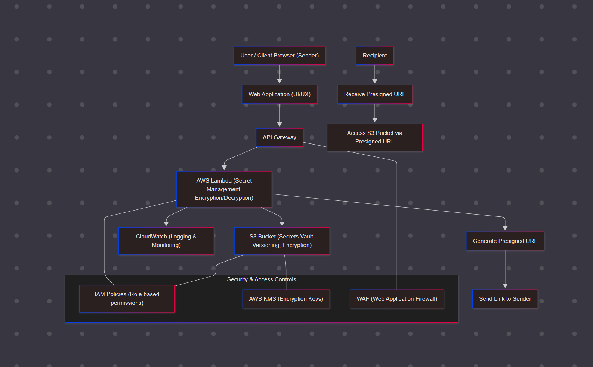

### Roadmap for SecretSentry Reconstruction

## Diagram

## 1. Refine Project Requirements & Architecture Blueprint
**Clarify Use Cases:**
- Ensure we capture all the scenarios around secret sharing, such as how secrets are created, updated, and ultimately expired or revoked.
- Validate assumptions about the three-day link lifetime—should it support one-time access, multiple accesses within that time, or be limited in usage?

**Establish a Clear Security Model:**
- Define roles and responsibilities (both for users and administrative operations).
- Revisit the threat model: Beyond unauthorized access, consider abuse (e.g., brute force on presigned URLs) and insider threats.

## 2. Enhance the Serverless & Security-First Architecture
**S3 – The Secure Vault:**
- Encryption & Key Management: Use AWS KMS-managed keys to encrypt secrets stored in S3. This ensures that encryption keys are centrally managed and audited.
- Versioning & Access Logs: Keep versioning enabled to allow for secret recovery and ensure that S3 access logging is activated to monitor any anomalous access patterns.

**Presigned URLs Improvements:**
- Dynamic Validity & Usage Limits: In addition to a fixed three-day validity, consider enforcing usage limits (e.g., one-time or limited number of accesses).
- Tokenized Access: Combine presigned URLs with short-lived tokens stored in a lightweight database (like DynamoDB) to add another layer of access control and usage tracking.

**Lambda Functions & API Gateway:**
- Granular IAM Policies: Ensure each Lambda function and API Gateway endpoint has the minimum required permissions using the principle of least privilege.
- Web Application Firewall (WAF): Place AWS WAF in front of API Gateway to filter out malicious requests and protect against common web exploits.

## 3. DevOps & Automation Strategy
**Infrastructure as Code (IaC):**
- Use AWS CloudFormation or Terraform to codify your infrastructure. This includes S3 buckets, Lambda functions, API Gateway configuration, and IAM policies. IaC enables versioning, rollback, and reproducibility.

**CI/CD Pipeline:**
- Automated Testing: Integrate unit, integration, and security tests (e.g., verifying URL expiry and secret decryption flows) into your CI pipeline using tools like AWS CodeBuild or third-party solutions.
- Continuous Delivery: Set up pipelines (via AWS CodePipeline or GitHub Actions) to deploy across environments (development, staging, production) with automated rollbacks in case tests fail.

**Monitoring & Logging:**
- CloudWatch & CloudTrail: Use CloudWatch for real-time metrics and alerts. CloudTrail should be configured to track API activity for compliance and forensic analysis.
- Enhanced Observability: Consider integrating AWS X-Ray for distributed tracing to quickly diagnose issues in your Lambda functions.

## 4. Operational Best Practices
**Cost Management:**
- Use AWS Cost Explorer and set budgets/alerts to monitor spending, especially since services like Lambda and S3 can scale rapidly.

**Testing Environments & Rollback Plans:**
- Maintain isolated staging and production environments.
- Create a clear rollback and incident response plan. Use blue-green or canary deployments to minimize the impact of changes.

**Documentation & Continuous Improvement:**
- Document all processes (IaC, CI/CD configurations, security policies) and maintain a knowledge base.
- Schedule regular reviews to update policies and procedures as new security best practices emerge.

## 5. UI/UX and Frontend Integration
**Modern Frontend Framework:**
- For the intuitive UI/UX, leverage frameworks like React or Vue, and consider hosting with AWS Amplify for seamless integration with your backend services.

**Secure Communication:**
- Ensure that all interactions between the frontend and API Gateway are secured via HTTPS and that sensitive information is handled carefully (e.g., never exposing presigned URLs unnecessarily).

## Summary of Key Differentiators
- Enhanced Security Layers: Beyond presigned URLs and basic IAM policies, add KMS-based encryption, usage limits, tokenized access, and WAF protections.
- Infrastructure Automation: Codify your entire stack using IaC to ensure repeatability, consistency, and quick disaster recovery.
- CI/CD & Observability: Integrate automated testing, deployment pipelines, and detailed monitoring to catch issues early and respond swiftly.
- Cost & Operational Excellence: Use AWS’s built-in tools to monitor resource utilization, costs, and operational health, ensuring the project is both secure and efficient.

This approach not only modernizes our development and deployment processes but also embeds security into every layer of the application—key for a platform dealing with sensitive data.